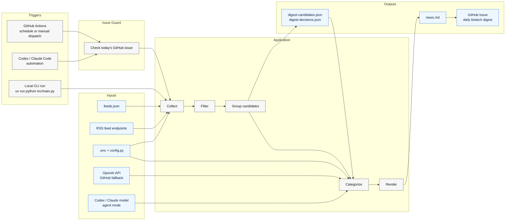
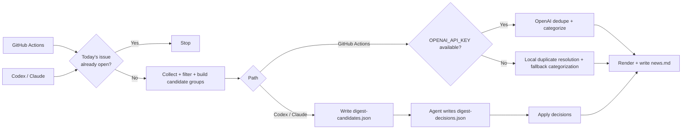

# bio-news-agent

A lightweight AI agent that grabs fresh biotech/pharma headlines and posts a daily digest to GitHub Issues.

🔔 **Watch this repository** to receive the daily biotech news digest email delivered straight to your inbox.

Scheduled runs check for today's digest issue before calling the LLM, so fallback CI skips duplicate builds.
Push and pull request CI runs `pytest` and `mypy`.
Scheduled agent runs generate locally and dispatch the final publish through GitHub Actions. Direct `--publish-issue` remains a manual fallback.

## Architecture





## Prerequisites

- Python 3.12+ with pip

## Quick Start

### 1. Install UV

```bash
pip install uv
```

### 2. Configure
```bash
cp .env.example .env
# Edit .env and add your OPENAI_API_KEY
# Placeholder values such as sk-... or your_api_key_here are treated as missing
```

### 3. Run
```bash
uv run python src/main.py
```

## Agent-driven mode

This path keeps feed collection and filtering in Python, but lets Codex or Claude Code handle dedupe/categorization without `OPENAI_API_KEY`.
For the full daily-agent runbook, see [AGENTS.md](AGENTS.md).

```bash
uv run python src/main.py --check-issue --issue-status-file digest-issue-status.json
uv run python src/main.py --candidates-only
# agent reads digest-candidates.json and writes digest-decisions.json
uv run python src/main.py --apply-decisions digest-decisions.json
uv run python src/main.py --dispatch-publish
```

`--check-issue` writes `digest-issue-status.json` by default. `--candidates-only` writes `digest-candidates.json` and `digest-run-status.json` by default. Use `--candidates-file <path>`, `--status-file <path>`, and `--issue-status-file <path>` to override these artifacts.

Daily agent runs:

- Stop on `ok: true` plus `exists: true`, or on `ok: false` plus `retryable: false`.
- Continue only on `ok: false` plus `retryable: true`.
- Run candidate export with `RSS_MAX_WORKERS=2 RSS_TIMEOUT=15`; retry once with `RSS_MAX_WORKERS=1 RSS_TIMEOUT=20` on `feed_fetch_failed` or `empty_snapshot_with_feed_errors`.
- Write `digest-decisions.json`, run `--apply-decisions`, then run `--dispatch-publish`.
- After dispatch, wait briefly and re-run `--check-issue` to confirm the issue exists.

`--dispatch-publish` prefers `GITHUB_TOKEN` or `GH_TOKEN` with workflow-dispatch access and falls back to authenticated local `gh`. Direct `--publish-issue` is still available as a manual fallback.

Agent decisions should use this JSON shape:

```json
{
  "executive_summary": "2-3 sentence overview of today's biotech news.",
  "top_stories": ["g1i1"],
  "groups": [
    {
      "group_id": "g1",
      "off_topic_ids": ["g1i3"],
      "clusters": [
        {
          "keep_id": "g1i1",
          "duplicate_ids": ["g1i2"],
          "category": "Clinical & Research",
          "short_title": "Pfizer posts oncology trial results",
          "summary_line": "Why this matters in one sentence.",
          "tier": "high"
        }
      ]
    }
  ]
}
```

The default digest output is compact and title-first. `executive_summary` and `summary_line` are optional enrichment fields; the renderer keeps top stories and category sections skimmable even when those fields are present.
By default, `Company News` is capped to the top 3 ranked items to keep the daily digest quick to scan.
`--dispatch-publish` sends the rendered digest to the publish-only GitHub Actions workflow so the final issue author is `app/github-actions`, which is friendlier to watch-email notifications than publishing through your own local GitHub identity.

## Feed configuration

The collector reads RSS feed URLs from [`feeds.json`](feeds.json) in the project root. The
file should contain a JSON object where each key is a feed URL and each value
specifies the `category` and human-readable `source` name.

Optional fields:

- `type`: source-specific handling such as paper limits
- `source_role`: source authority for duplicate tie-breaks and ranking. Supported values: `primary`, `independent_reporting`, `commentary`, `community`.
- `feed_mode`: whether a feed is part of the main digest or supporting discovery only. Supported values: `core`, `discovery_only`.

```json
{
  "https://example.com/feed.xml": {
    "source": "Example Feed",
    "category": "All",
    "type": "news",
    "source_role": "independent_reporting",
    "feed_mode": "core"
  }
}
```

Pipeline notes:

- Exact duplicates are removed by normalized URL before any LLM call.
- The collector preserves `original_title` and RSS `summary` for duplicate resolution.
- Source-specific low-signal items such as webinars, sponsored posts, opinion pieces, people-move roundups, and bundled roundup headlines are dropped before grouping.
- Mixed regulator and institutional feeds can also be gated by source-specific title or link rules before grouping.
- The source cap is still applied before LLM dedupe for diversity and lower cost.
- Candidate export also writes `digest-run-status.json` with feed health, group counts, and sample `feed_errors` for automation use.
- `--check-issue` writes `digest-issue-status.json` through the same repo-local GitHub path used for publishing, preferring `GITHUB_TOKEN` / `GH_TOKEN` and falling back to local `gh` auth. On failure it still writes a status artifact with `ok: false`, a `reason`, an `error_kind`, and a `retryable` flag so automation can distinguish transient GitHub failures from hard auth/config errors.
- `--candidates-only` exits nonzero only when feed health is bad enough to make the snapshot unreliable. Healthy empty days are reported as `reason: "no_fresh_items"` without failing.
- Lower-priority `Company News` items are capped after ranking to keep fallback digests compact.
- `discovery_only` feeds can still merge into a core story and contribute coverage context, but standalone discovery-only items are dropped before final render.
- Placeholder OpenAI API keys from either the shell environment or `.env` are ignored for local runs.
- LLM request timeouts retry before falling back to local duplicate resolution.
- The LLM receives candidate groups and returns structured duplicate clusters instead of line-based `SKIP` output.
- `--dispatch-publish` triggers `.github/workflows/publish-digest.yml` with a compressed digest payload, and that workflow runs the repo-local `--publish-issue` path on GitHub Actions. Direct `--publish-issue` remains a manual fallback.
- Short display titles are generated only for kept items after duplicates are resolved.
