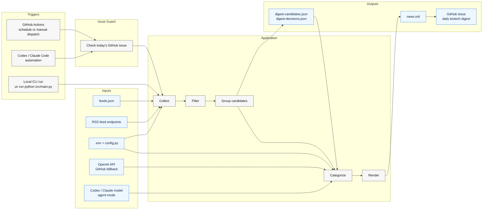
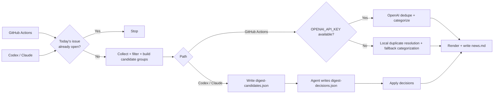

# bio-news-agent

A lightweight AI agent that grabs fresh biotech/pharma headlines and posts a daily digest to GitHub Issues.

🔔 **Watch this repository** to receive the daily biotech news digest email delivered straight to your inbox.

Scheduled runs check for today's digest issue before calling the LLM, so fallback CI skips duplicate builds.

## Architecture





## Prerequisites

- Python 3.12+ with pip

## Quick Start

### 1. Install UV

```bash
pip install uv
```

### 2. Configure
```bash
cp .env.example .env
# Edit .env and add your OPENAI_API_KEY
# Placeholder values such as sk-... or your_api_key_here are treated as missing
```

### 3. Run
```bash
cd bio-news-agent
uv run python src/main.py
```

## Agent-driven mode

This path keeps feed collection and filtering in Python, but lets Codex or Claude Code handle dedupe/categorization without `OPENAI_API_KEY`.
For scheduled agent runs, prefer a local runner so the job can use your machine's network and GitHub auth; keep GitHub Actions as the later fallback.

```bash
uv run python src/main.py --candidates-only
# agent reads digest-candidates.json and writes digest-decisions.json
uv run python src/main.py --apply-decisions digest-decisions.json
```

`--candidates-only` writes `digest-candidates.json` by default. Use `--candidates-file <path>` to override the snapshot path for either step.

Runner setup:

- Codex: check today's issue first, run `uv sync --locked`, run `uv run python src/main.py --candidates-only`, write `digest-decisions.json`, then run `uv run python src/main.py --apply-decisions digest-decisions.json`.
- Claude Code: use the same two-step flow and the same `digest-decisions.json` schema.

Agent decisions should use this JSON shape:

```json
{
  "groups": [
    {
      "group_id": "g1",
      "off_topic_ids": ["g1i3"],
      "clusters": [
        {
          "keep_id": "g1i1",
          "duplicate_ids": ["g1i2"],
          "category": "Clinical & Research",
          "short_title": "Pfizer posts oncology trial results"
        }
      ]
    }
  ]
}
```

After `--apply-decisions`, the existing issue publishing step can post `news.md` as usual.

## Feed configuration

The collector reads RSS feed URLs from [`feeds.json`](feeds.json) in the project root. The
file should contain a JSON object where each key is a feed URL and each value
specifies the `category` and human-readable `source` name.

An optional `type` field can be used for source-specific handling such as paper limits:

```json
{
  "https://example.com/feed.xml": {
    "source": "Example Feed",
    "category": "All",
    "type": "news"
  }
}
```

Pipeline notes:

- Exact duplicates are removed by normalized URL before any LLM call.
- The collector preserves `original_title` and RSS `summary` for duplicate resolution.
- Obvious noise titles such as webinars, sponsored posts, and opinion items are dropped before grouping.
- The source cap is still applied before LLM dedupe for diversity and lower cost.
- Placeholder OpenAI API keys from either the shell environment or `.env` are ignored for local runs.
- LLM request timeouts fall back to local duplicate resolution instead of repeatedly retrying.
- The LLM receives candidate groups and returns structured duplicate clusters instead of line-based `SKIP` output.
- Short display titles are generated only for kept items after duplicates are resolved.
