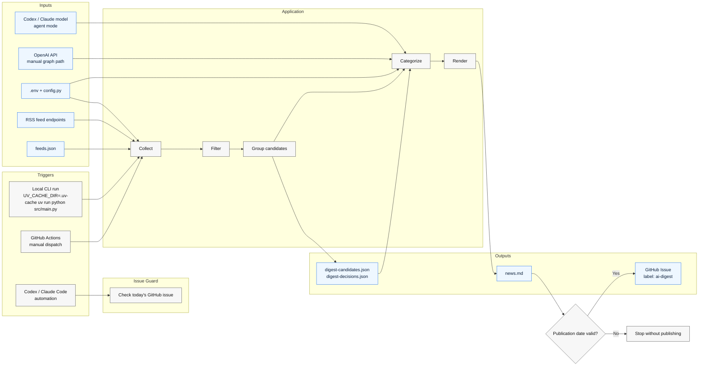
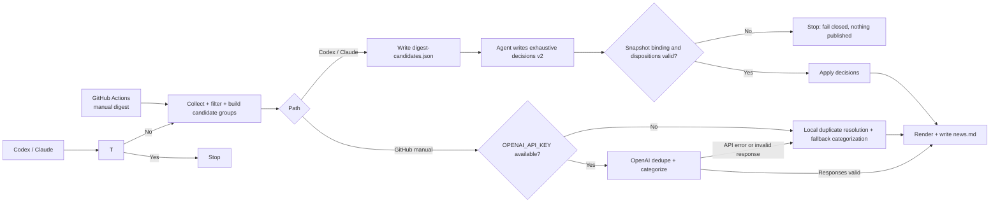

# Architecture

## Pipeline

## Pipeline Notes

- Exact duplicates are removed by normalized URL before any LLM call.
- The collector preserves `original_title` and RSS `summary` for duplicate resolution.
- Regular comparison grouping also uses article-URL basename hints: at least two distinct alphabetic tokens of six or more characters must match the other item's original headline or summary, excluding configured company names and generic news/date words. Hostnames, parent directories, queries, and fragments do not supply hints. These hints only create editorial comparison opportunities; groups can contain distinct events and every merge still requires an explicit decision. Local fallback grouping does not use URL hints.
- Local fallback merges only nonempty original headlines equal after case folding and whitespace normalization within an existing candidate group. A usable `title` is used only when the original is absent or unusable. Candidate grouping remains fuzzy, including the broader fallback grouping; numbers, punctuation, word order, negation, and differing originals prevent local merging. More near-duplicates may remain, and identical generic headlines do not prove semantic identity; see the [local fallback contract](development.md#api-response-contract).
- Source-specific low-signal items such as webinars, sponsored posts, opinion pieces, people-move roundups, and bundled roundup headlines are dropped before grouping.
- Mixed regulator and institutional feeds can be gated by source-specific title or link rules before grouping.
- The source cap is applied before LLM dedupe for diversity and lower cost.
- Candidate export writes `digest-run-status.json` with feed health, group counts, and sample `feed_errors` for automation use.
- Candidate schema v5 binds decisions schema v2 through the exact exported `snapshot_id`. Decisions must include every candidate group and disposition every item exactly once. Validation completes before keep promotion; only afterward does rendering remove standalone `discovery_only` keeps.
- `--check-issue` writes `digest-issue-status.json`, preferring authenticated `gh` locally and `DIGEST_GITHUB_TOKEN`, `GITHUB_TOKEN`, or `GH_TOKEN` in GitHub Actions.
- On GitHub failure, the issue-status artifact includes `ok: false`, a `reason`, an `error_kind`, and a `retryable` flag.
- `--candidates-only` exits nonzero only when feed health is bad enough to make the snapshot unreliable. Empty days are reported as `reason: "no_fresh_items"` without failing, even when optional feeds have warnings.
- Lower-priority `Company News` items are capped after ranking to keep fallback digests compact.
- `discovery_only` feeds can still merge into a core story and contribute coverage context, but standalone discovery-only items are dropped before final render.
- Placeholder OpenAI API keys from either the shell environment or `.env` are ignored for local runs.
- LLM request timeouts retry before falling back to local duplicate resolution. Malformed responses and invalid dispositions also enter that existing fallback. Each complete API response is validated before applying its contents or promoting a keep; see the [API response contract and local fallback limits](development.md#api-response-contract).
- The LLM receives candidate groups and returns structured duplicate clusters.
- `--dispatch-publish` triggers `.github/workflows/publish-digest.yml` with a compressed digest payload; that workflow runs the repo-local `--publish-issue` path on GitHub Actions.
- `.github/workflows/digest.yml` is manual-only. Manual dispatch skips its schedule-only preflight, runs the API graph, and rechecks the issue idempotently only when publishing.
- Direct `--publish-issue` remains a manual fallback.
- Short display titles are generated only for kept items after duplicates are resolved.
- Publication uses one frozen Eastern date for dispatch inputs, title generation and issue selection. Actions requires `DIGEST_DATE`; missing, malformed or noncurrent dates fail closed, with a second date check after issue lookup before starting a write.
- `digest.yml` and `publish-digest.yml` share one repository-wide Actions concurrency group, retain pending runs with `queue: max`, and do not cancel the active run. Direct manual publication bypasses that lock. See [publication safety and rollout limits](development.md#publication-safety).
