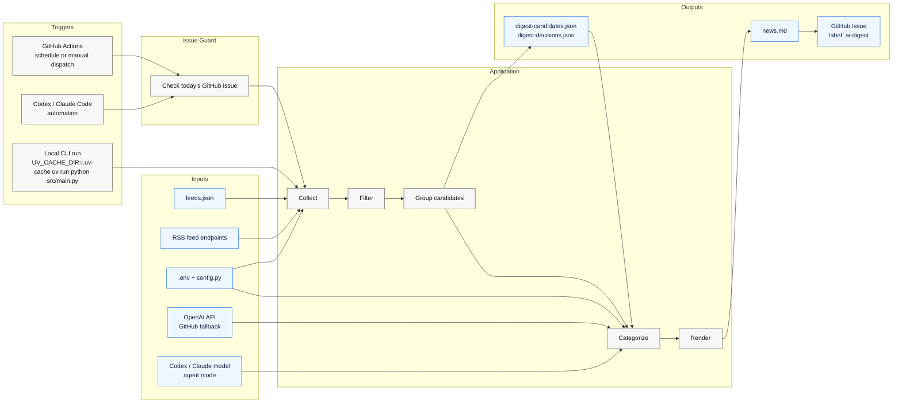
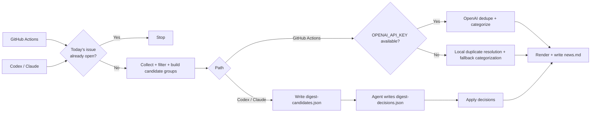

# Architecture

## Pipeline

## Pipeline Notes

- Exact duplicates are removed by normalized URL before any LLM call.
- The collector preserves `original_title` and RSS `summary` for duplicate resolution.
- Source-specific low-signal items such as webinars, sponsored posts, opinion pieces, people-move roundups, and bundled roundup headlines are dropped before grouping.
- Mixed regulator and institutional feeds can be gated by source-specific title or link rules before grouping.
- The source cap is applied before LLM dedupe for diversity and lower cost.
- Candidate export writes `digest-run-status.json` with feed health, group counts, and sample `feed_errors` for automation use.
- `--check-issue` writes `digest-issue-status.json`, preferring authenticated `gh` locally and `DIGEST_GITHUB_TOKEN`, `GITHUB_TOKEN`, or `GH_TOKEN` in GitHub Actions.
- On GitHub failure, the issue-status artifact includes `ok: false`, a `reason`, an `error_kind`, and a `retryable` flag.
- `--candidates-only` exits nonzero only when feed health is bad enough to make the snapshot unreliable. Empty days are reported as `reason: "no_fresh_items"` without failing, even when optional feeds have warnings.
- Lower-priority `Company News` items are capped after ranking to keep fallback digests compact.
- `discovery_only` feeds can still merge into a core story and contribute coverage context, but standalone discovery-only items are dropped before final render.
- Placeholder OpenAI API keys from either the shell environment or `.env` are ignored for local runs.
- LLM request timeouts retry before falling back to local duplicate resolution.
- The LLM receives candidate groups and returns structured duplicate clusters.
- `--dispatch-publish` triggers `.github/workflows/publish-digest.yml` with a compressed digest payload; that workflow runs the repo-local `--publish-issue` path on GitHub Actions.
- Direct `--publish-issue` remains a manual fallback.
- Short display titles are generated only for kept items after duplicates are resolved.
